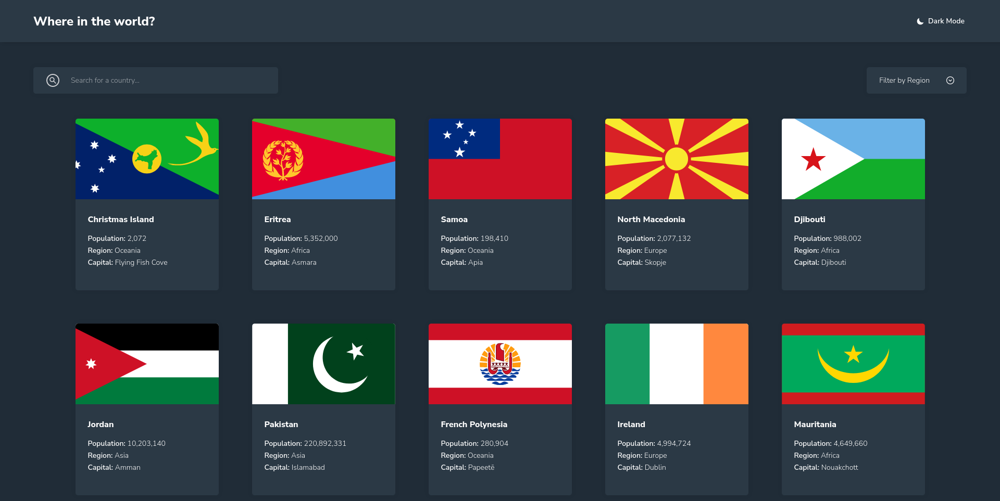

# World countries info app

This is a solution to the [REST Countries API with color theme switcher challenge on Frontend Mentor](https://www.frontendmentor.io/challenges/rest-countries-api-with-color-theme-switcher-5cacc469fec04111f7b848ca). It's built with Angular 16 and pulls data from the REST Countries API. It stores the last query done by the user and the results returned, as well as the preferred color theme (which can be switched through a toggle) using localStorage.

All icons used in this project were created by Alessio Atzeni, from his [Metrize](https://www.alessioatzeni.com/metrize-icons/) and [Meteocons](https://www.alessioatzeni.com/meteocons/) icon sets.

A live version of the app can be seen [here](https://rest-countries-api-elyosis.netlify.app/).

## Overview

### The challenge

Users should be able to:

- See all countries from the API on the homepage
- Search for a country using an `input` field
- Filter countries by region
- Click on a country to see more detailed information on a separate page
- Click through to the border countries on the detail page
- Toggle the color scheme between light and dark mode *(optional)*

### Screenshot

